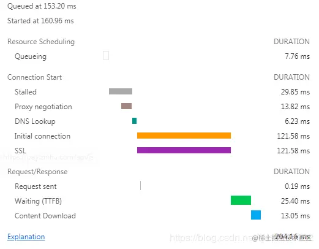

一个完整的 HTTP 请求需要经历 
DNS 查找
TCP 握手
浏览器发出 HTTP 请求
服务器接收请求
服务器处理请求并发回响应
浏览器接收响应等过程
接下来看一个具体的例子帮助理解 HTTP ：

- Queueing: 请求从加入到请求队列中到请求开始处理经过的时间。
- Stalled（阻塞）: 请求在可以被发送出去之前的等待时间（阻塞时间），一般是等待可复用的TCP连接释放的时间。浏览器对于单个域名只能同时建立4~6个TCP连接（不同浏览器实现有差异）。也是从TCP 连接建立完成，到真正可以传输数据之间的时间差，此时间包括代理协商时间。
- Proxy negotiation: 与代理服务器连接进行协商所花费的时间。
- DNS Lookup: 执行DNS查找所花费的时间，页面上的每个不同的域都需要进行DNS查找。
- Initial Connection / Connecting: 建立连接所花费的时间，包括TCP握手/重试和协商SSL。
- SSL: 完成SSL握手所花费的时间。
- Request sent: 发出网络请求所花费的时间，通常为一毫秒的时间。
- Waiting(TFFB): TFFB 是发出页面请求到接收到应答数据第一个字节的时间。
- Content Download: 接收响应数据所花费的时间。

从这个例子可以看出，真正下载数据的时间占比为 13.05 / 204.16 = 6.39%，文件越小，这个比例越小，文件越大，比例就越高。
这就是为什么要建议将多个小文件合并为一个大文件，从而减少 HTTP 请求次数的原因。

具体分析：

# Stalled（阻塞）

浏览器对同一个主机域名的并发连接数有限制，因此如果当前的连接数已经超过上限，那么其余请求就会被阻塞，等待新的可用连接；此外脚本也会阻塞其他组件的下载；
**优化措施：**

1、将资源合理分布到多台主机上，可以提高并发数，但是增加并行下载数量也会增大开销，这取决于带宽和CPU速度，过多的并行下载会降低性能；
2、脚本置于页面底部；

## DNS Lookup（域名解析）
请求某域名下的资源，浏览器需要先通过DNS解析器得到该域名服务器的IP地址。在DNS查找完成之前，浏览器不能从主机名那里下载到任何东西。

**优化措施：**

　　1、利用DNS缓存（设置TTL时间）；
　　2、利用Connection:keep-alive特性建立持久连接，可以在当前连接上进行多个请求，无需再进行域名解析；

## Initial connection（初始化连接）

TCP建立连接的三次握手时间

## SSL（包含于HTTPS连接中）

http是超文本传输协议，以明文方式发送内容，不提供任何方式的数据加密，如果被不法分子截取浏览器和服务器之间的传输报文，会获取其中的信息。

https 是安全套接字层超文本传输协议，就是在HTTP的基础上加入了SSL协议，SSL依靠证书来验证服务器的身份，并为浏览器和服务器之间的通信加密。

因此建立HTTPS连接的时间相当于三次握手的时间+SSL时间。

## Request sent（发送请求）

发送HTTP请求的时间（从第一个bit到最后一个bit）

**优化措施：**

1、减少HTTP请求，可以使用CSS Sprites、内联图片、合并脚本和样式表等；
2、对不常变化的组件添加长久的Expires头（相当于设置久远的过期时间），在后续的页面浏览中可以避免不必要的HTTP请求；

## Waiting（等待响应）

通常是耗费时间最长的。从发送请求到收到响应之间的空隙，会受到线路、服务器距离等因素的影响。

**优化措施：**

1、使用CDN，将用户的访问 指向距离最近的工作正常的缓存服务器上，由缓存服务器直接响应用户请求，提高响应速度；

## Content Download（下载）

下载HTTP响应的时间（包含头部和响应体）

**优化措施：**
1、通过条件Get请求，对比If-Modified-Since和Last-Modified时间，确定是否使用缓存中的组件，服务器会返回“304 Not Modified”状态码，减小响应的大小；
2、移除重复脚本，精简和压缩代码，如借助自动化构建工具grunt、gulp等；
3、压缩响应内容，服务器端启用gzip压缩，可以减少下载时间；
