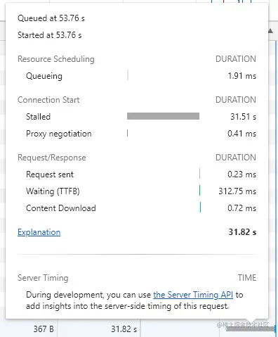

用谷歌浏览器对接接口的时候发现有一个接口偶尔需要几十秒的时间才能响应，而大部分时间都是正常的，在500毫秒的时间内可以完成响应，于是对此问题展开追溯。

查看该接口对应的 waterfall 信息，分析是哪一个部分用的时间过长，waterfall 信息如下图。

根据图可以看出该接口的 Waiting(TTFB) 部分是 312ms，说明后端响应的时间是完全正常的，问题并不出在后端。

stalled 的时间达到了惊人的 31.51s ，那么显而易见，问题出在了超长的 stalled 时间。

## stalled 的时间代表什么
stalled 的时间即为接口等待发送的时间。

谷歌浏览器对同一个域名保持 TCP 连接的数量是有限制的，谷歌浏览器目前可以认为是6个。如果我们同时向某个域名发起超过6个，那么超过的请求会被放在队列中，等待前面的连接释放才可以继续请求。

## stalled 时间超级长的原因
检查了一下所有的请求，发现原来是某个图片服务器挂掉了，导致某些图片请求一直 pending 中，无法释放。导致后续的请求超长等待

## 解决方案
图片服务器挂掉以后请求该图片时候并不会立即返回，把图片资源放到 CDN 中还是很重要的，这样可以防止阻塞资源加载。
获取不存在的资源或者服务挂起的情况下一样会占用网络资源，应该尽量避免。
