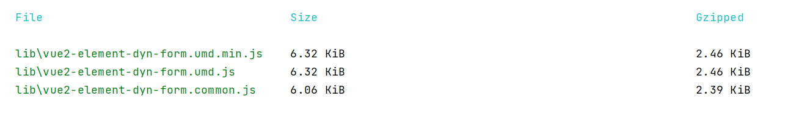
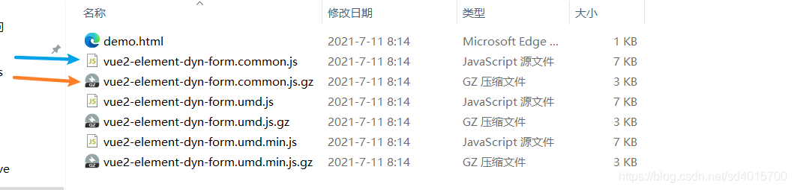
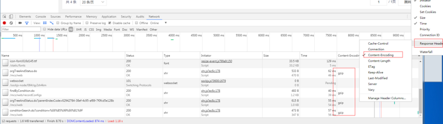
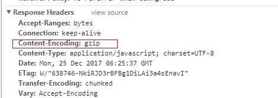

nginx分为实时gzip和静态gzip, 

实时gzip，就是无论静态资源有没有压缩，都给你使用gzip压缩一次，

静态gzip，就是当请求某个静态资源时，先找下该静态资源有没有对应的gz文件，如果有，那nginx就直接使用gz文件，而不再进行实时gzip压缩, 从而减少了nginx对cpu的使用，加快了响应速度. 不过要使用静态gzip必须要先启用nginx的`gzip_static` 模块.


Vue 没有 gzip，只是 Vue 利用了 Webpack 做打包，而 Webpack 有可以生成文件对应的 gz 文件的插件。

## CompressionPlugin已经给代码压缩一次了，那为什么还要进行一次gzip压缩?
gzip能在已经压缩的结果上，进一步进行压缩。

举个例子：
如下配置了`TerserPlugin`，该插件会对代码进行一次压缩，还配置了`CompressionPlugin`, 该插件会对大于5k的文件，进行gzip压缩，并生成gz文件，保留源文件。
接下来执行打包，我们来看下打包结果.
```javascript
configureWebpack: (config) => {
    if (process.env.NODE_ENV !== 'dev') {
      config.plugins.push(
        //去掉打包之后的打印
        new TerserPlugin({
          terserOptions: {
            compress: {
              drop_console: true
              // drop_debugger: false,
              // pure_funcs: ['console.log'] // 移除console
            }
          }
        })
      )
      config.plugins.push(
        new CompressionPlugin({
          filename: '[path][base].gz', //目标资源名称
          test: productionGzipExtensions, //匹配文件名
          algorithm: 'gzip',
          minRatio: 0.8, //只有压缩率比这个值小的资源才会被处理
          threshold: 5120, //对超过5k的数据压缩
          deleteOriginalAssets: false //不删除源文件
        })
      )
    }
  }

```
这是打包之后控制台输出的结果:

File列是文件名，Size列是文件经过TerserPlugin压缩之后的大小，Gzipped列是执行Gzipped压缩之后文件的大小，

再看下实际生成的结果文件:


以vue2-element-dyn-form.common.js和vue2-element-dyn-form.common.js.gz为例，注意他们的实际文件大小,与上一个控制台输出的结果相似，这就是为什么webpack压缩之后，还要进行一次gz压缩。gzip能在已压缩的基础上，再次进行压缩

- 之所以在webpack的TerserPlugin插件已对文件进行压缩的结果下，还进行一次gzip压缩，是因为gzip能够在已压缩文件的基础上，再次进行压缩
- 之所webpack和nginx都对静态资源进行gzip压缩，是为了让nginx能够优先使用静态gzip压缩，直接使用gz文件的结果作为gzip压缩的结果，从而减少实时gizp对cpu资源的占用

# 查看用gzip压缩的文件

content-encoding是gzip的话就说明返回的是gzip
