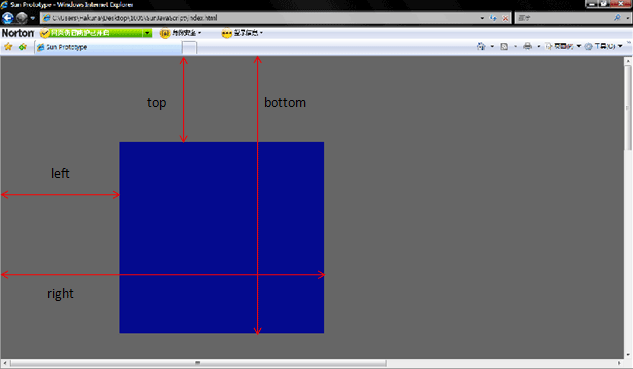
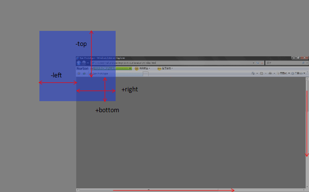
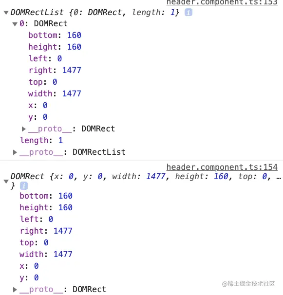

## getBoundingClientRect

getBoundingClientRect() 返回矩形的集合，
表示当前盒子在浏览器中的位置以及自身占据的空间的大小。
除了 width 和 height 以外（width 和 height包含了 padding 和 border-width，而不仅仅是内容部分的宽度和高度。在标准盒子模型中，这两个属性值分别与元素的 width/height + padding + border-width 相等。而如果是 box-sizing: border-box，两个属性则直接与元素的 width 或 height 相等。），
其他属性都是相对于 视图窗口的左上角 来计算的。
如：bottom 是盒子底部边框 距离 视口顶部 的距离；right 是盒子右侧边框距离视口左侧的距离。

视口（viewport）：在电脑图形学里面，视口代表了一个可看见的多边形区域（通常来说是矩形）。在浏览器范畴里，它代表的是浏览器中网站可见内容的部分。视口外的内容在被滚动进来前都是不可见的。

**getBoundingClientRect:** DOMRect

返回元素的大小及其相对于视口左上角的位置

**getClientRects：** DOMRectList

块级元素直接返回盒子模型的矩形范围。

行内元素会产生自动换行这类看似分割整体的歧义，所以，会把行内元素（inline）根据它换行划分成多个盒子边界矩形（返回多个DOMRect）。这是有时候同一个元素会返回多个DOMRect原因。

同一个元素两个方法返回值比较：

