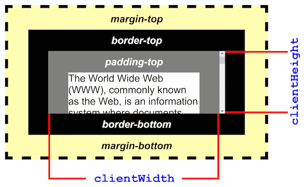
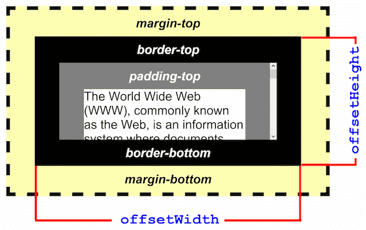
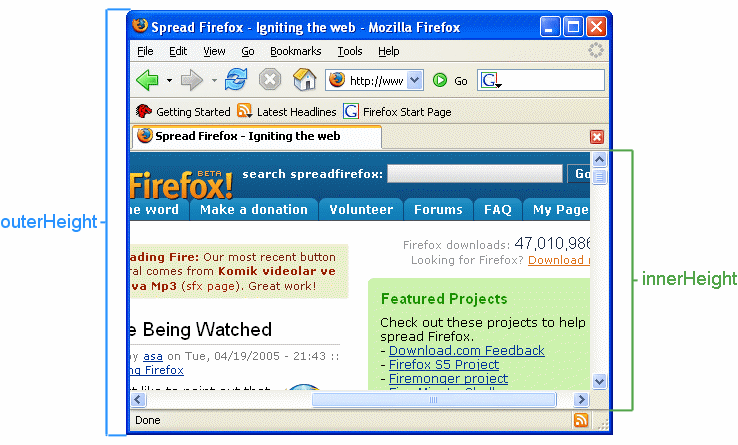
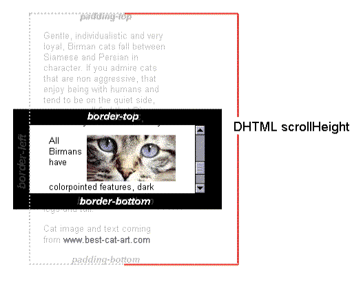

## clientHeight
- 在根元素（<html> 元素）或怪异模式下的 <body> 元素上使用 clientHeight 时，该属性将返回视口高度（不包含任何滚动条）
- 元素内部的高度（以像素为单位），包含内边距，但不包括边框、外边距和水平滚动条（如果存在）。
- 对于没有定义 CSS 或者内联布局盒子的元素为 0
- 只读属性

**clientHeight = visible content + padding**




## offsetHeight

- 返回元素的像素高度，高度包含该元素的垂直内边距和边框，且是一个整数
- 只读属性
- 是CSS高度的衡量标准，包括元素的边框、内边距和元素的水平滚动条（如果存在且渲染的话），不包含:before或:after等伪类元素的高度
- 如果元素被隐藏（元素或者元素的祖先之一的元素的style.display被设置为none），则返回0

**offsetHeight = visible content + padding + border + scrollbar**



## innerHeight
- 返回window的内部高度，包括横向滚动条
- 与之对应的还有一个outerHeight，是整个浏览器窗口的大小，包括窗口标题、工具栏、状态栏等



## scrollHeight
- 一个元素内容高度的度量，包括溢出的视图中不可见内容
- 没有垂直滚动条的情况下，scrollHeight值与元素视图填充所有内容所需要的最小值clientHeight相同
- 包括元素的padding，但不包括元素的border和margin
scrollHeight也包括::before,::after这样的伪元素
- 只读属性



举例：<https://www.w3schools.com/jsref/prop_element_scrollheight.asp>

<https://segmentfault.com/a/1190000023060419>
## 判断元素是否滚动到底
scrollTop是一个非整数，而scrollHeight和clientHeight是四舍五入的，因此确定滚动区域是否滚动到底的唯一方法是查看滚动量是否足够接近某个阈值 (在本例中为1)

```javascript
Math.abs(element.scrollHeight - element.clientHeight - element.scrollTop) < 1
```
以下内容 不 会一直有效，因为scrollTop可能包含小数：

```javascript
element.scrollHeight - Math.abs(element.scrollTop) === element.clientHeight

```

## 判断元素是否能滚动
当容器不滚动但有溢出的子容器时，这些检查可以确定容器能否滚动：

```javascript
window.getComputedStyle(element).overflowY === 'visible'
window.getComputedStyle(element).overflowY !== 'hidden'


```
